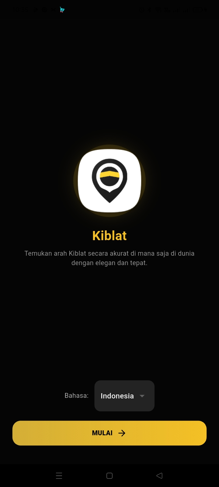
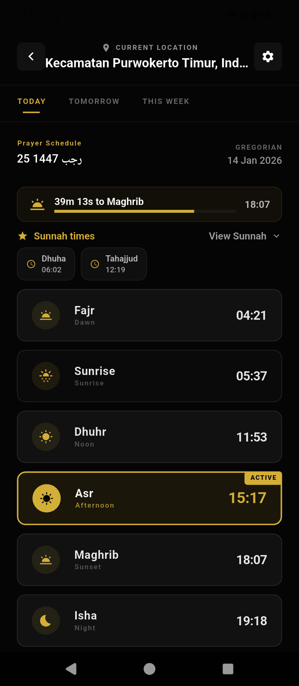
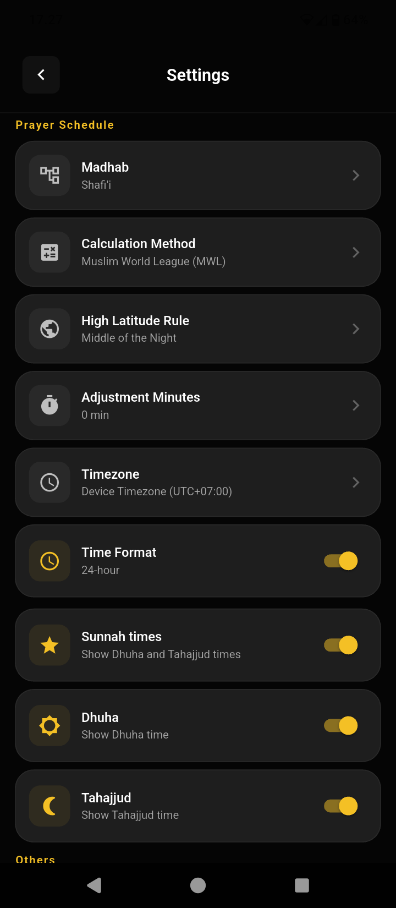
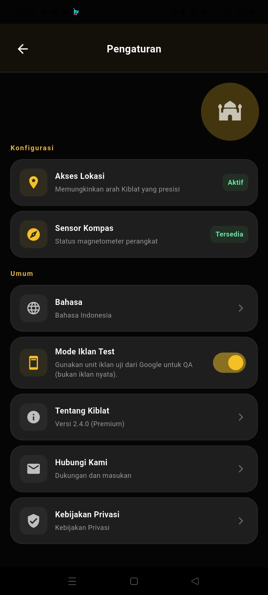

# Kiblat 📍 — Qibla + Prayer Buddy

[](https://play.google.com/store/apps/details?id=id.onyet.app.kiblat)

Hey! Kiblat is a tiny, chill Flutter app that points you to the Kaaba and now also shows prayer times. It uses your device's compass and location to give accurate bearings, and it's fully localized so it speaks your language. ✨

---

## What it does (TL;DR) ✅

- Shows precise Qibla direction with a smooth animated compass
- Displays local prayer times + reminders (notifications)
- Shows distance to Kaaba (in km)
- Simple settings: calculation method, timezone, notifications
- Localized UI and improved accessibility

---

## What's New — Release Highlights

- **Prayer Times** added: local prayer schedule, reminders, and prayer details.
- **Home refreshed:** quick glance shows Qibla + next prayer time.
- **Prayer settings:** pick calculation method, timezone handling, notification prefs.
- **Small improvements:** translations, accessibility, and snappier UI.

---

## Screenshots 🖼️

Gallery (2x2 + single):

| | |
|---:|:---|
|  |  |
|  |  |
|  | |

---

## How it works (short nerdy bit) 🔧

- Qibla bearing: we compute the great-circle initial bearing from your location to the Kaaba (lat: 21.422487, lon: 39.826206). See `LocationService.qiblaBearing(lat, lon)`.
- Distance: spherical law of cosines -> distance in km. See `LocationService.distanceToKaabaKm(lat, lon)`.

Why great-circle? 'Cause Earth ain't flat and these formulas are accurate globally.

---

## Run locally (quickstart) 🚀

Requirements: Flutter SDK and a device/emulator with location & sensors.

1. Install deps:

```bash
flutter pub get
```

2. Run the app:

```bash
flutter run
```

Notes: Android needs location permission; iOS needs Info.plist keys (already in the repo). If you use Google Maps, add your API key in platform files.

---

## Build release (Android AAB) 🔒

1. Put your keystore (e.g., `keystore.jks`) in `android/` and create `android/key.properties` with local secrets (DO NOT commit):

```text
storePassword=YOUR_STORE_PASSWORD
keyPassword=YOUR_KEY_PASSWORD
keyAlias=YOUR_KEY_ALIAS
storeFile=keystore.jks
```

2. Build AAB:

```bash
flutter build appbundle --release
```

3. Upload `build/app/outputs/bundle/release/app-release.aab` to Play Console.

> Keep `android/key.properties` out of source control. Use CI secrets for automated builds.

---

## Where to look in the code 🧭

- `lib/screens/home_screen.dart` — compass UI & distance display
- `lib/screens/prayer_screen.dart` — prayer times UI
- `lib/screens/settings/prayer_settings_screen.dart` — prayer settings
- `lib/services/location_service.dart` — permission checks, heading stream, `qiblaBearing`, `distanceToKaabaKm`
- `assets/translations/` — locale JSONs

---

## Contribute / notes ✨

- Add screenshots to `assets/screenshots/` and tweak README. Contributions welcome.
- For even more precise geodesy, consider vincenty or geographiclib — current math is fine for practical use.

---

## QA & Test Ad Mode 🧪

- Debug builds auto-enable Test Ad Mode.
- In production you can toggle **Settings → Test Ad Mode** (saved via `SharedPreferences` key: `ad_test_mode`).
- Test mode uses Google’s test interstitial ad IDs and preloads ads for quick testing.

QA tips: watch logs for `[AdService]` and test exit flow to confirm interstitial behavior.

---

## Contact & Privacy 🔐

- **Privacy Policy:** https://onyet.github.io/privacy-police.html
- **Support:** onyetcorp@gmail.com (or WhatsApp: +62 822-2187-4400)

---

## Testing checklist ✔️

- Enable **Test Ad Mode** and confirm test interstitials load.
- Verify welcome/reset flows and interstitial behavior on exit.

---

License: MIT

