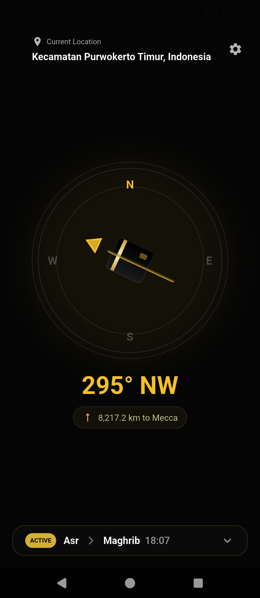

# Kiblat 📍

A lightweight Flutter app that shows the precise Qibla direction (towards the Kaaba in Mecca) using the device compass and the device's current location. The app is localized and includes a welcome/splash screen, a compass-style dial with animated Qibla arrow, and helpful permission/error dialogs.

---

## Features ✅

- Animated splash and welcome screens
- Localization (multiple languages)
- Real-time compass heading (smoothened) with a rotating dial
- Precise Qibla bearing calculation (great-circle initial bearing)
- Distance to the Kaaba (Great-circle distance)
- Permission checks and friendly errors for missing sensors or denied permissions
- Settings/Permissions UI (planned)

---

## Screenshots 🖼️

> Replace the images below with real screenshots when available (place files under `/assets/screenshots/`)

| Screen | Screenshot |
|---|---|
| Home / Compass |  |
| Welcome / Language Selector |  |
| Permission dialog |  |


---

## How it works — Qibla direction & distance 🔧

### Qibla bearing (initial great-circle bearing)

To determine the Qibla direction we compute the initial bearing (forward azimuth) from the device's location to the Kaaba coordinates (lat: 21.422487, lon: 39.826206). The implementation uses the great-circle formula for the initial bearing (also called the forward azimuth):

- Convert lat/lon to radians
- dLon = lon2 - lon1
- x = sin(dLon) * cos(lat2)
- y = cos(lat1)*sin(lat2) - sin(lat1)*cos(lat2)*cos(dLon)
- bearing = atan2(x, y) in degrees, normalized to [0, 360)

In code: see `LocationService.qiblaBearing(lat, lon)` (lib/services/location_service.dart).

### Distance to the Kaaba (Great-circle distance)

Distance is calculated using the spherical law of cosines (a robust great-circle method):

- Convert lat/lon to radians
- dLon = lon2 - lon1
- central_angle = acos( sin(lat1)*sin(lat2) + cos(lat1)*cos(lat2)*cos(dLon) )
- distance = R * central_angle (R ≈ 6,371 km)

This is implemented in `LocationService.distanceToKaabaKm(lat, lon)`.

Why not planar math? The Earth is approximately spherical and great-circle methods provide accurate distances for any global separation.

---

## Run locally 🚀

Requirements: Flutter SDK (see https://flutter.dev), a device or emulator with location and sensors for best results.

1. Get dependencies:

```
flutter pub get
```

2. Run:

```
flutter run
```

Note: On Android you need location permission; on iOS add the required Info.plist keys (already set in this project). If you intend to show Google Maps, add your API key as described in platform files.

---

## Where to look in code 🧭

- `lib/screens/home_screen.dart` — main compass UI, loader behavior, and localized distance readout
- `lib/services/location_service.dart` — permission checks, heading stream, `qiblaBearing`, `distanceToKaabaKm`
- `lib/screens/arrow_painter.dart` — custom arrow drawing for Qibla pointer
- `assets/translations/` — translation JSON files

---

## Contribution & Notes 🛠️

- Feel free to add real screenshots to `assets/screenshots/` and update the README accordingly.
- For more precise geodesy (ellipsoidal calculations) consider using a geodesy library (e.g., vincenty or geographiclib) — current implementation is sufficient for most practical uses.

---

License: MIT
